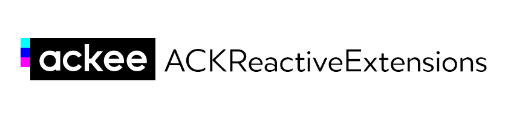

[](https://travis-ci.org/AckeeCZ/ACKReactiveExtensions)
[](http://cocoapods.org/pods/ACKReactiveExtensions)
[](http://cocoapods.org/pods/ACKReactiveExtensions)
[](http://cocoapods.org/pods/ACKReactiveExtensions)

# ACKReactiveExtensions

ACKReactiveExtensions is set of useful extensions for ReactiveCocoa you could use in your apps.

Currently we have extensions for
- [AlamofireImage](https://github.com/Alamofire/AlamofireImage)
- [Argo](https://github.com/thoughtbot/Argo)
- [Marshal](https://github.com/utahiosmac/Marshal)
- [Reachability](https://github.com/tonymillion/Reachability)
- [Realm](https://github.com/realm/realm-cocoa)
- [SDWebImage](https://github.com/rs/SDWebImage)
- UIKit
- WebKit

If you'd love to have more extensions available just open an issue or even better create a pull request!

## Installation

ACKReactiveExtensions is available through [CocoaPods](http://cocoapods.org). Simply add the following line to your Podfile:

```ruby
pod "ACKReactiveExtensions"
```

### Requirements

- Xcode 8.x
- Swift 3.x
- iOS 8.3 and newer

For Swift 2.x compatible version use ACKReactiveExtensions in 1.2.x version.

## Subspecs
By using `pod "ACKReactiveExtensions"` you will get only general and UIKit extensions but there are also subspecs you can like/need.

```ruby
pod 'ACKReactiveExtensions/AlamofireImage'
pod 'ACKReactiveExtensions/Argo'
pod 'ACKReactiveExtensions/Marshal'
pod 'ACKReactiveExtensions/Reachability'
pod 'ACKReactiveExtensions/Realm'
pod 'ACKReactiveExtensions/SDWebImage'
pod 'ACKReactiveExtensions/WebKit'
```
These subspecs mostly require aditional dependencies (as Argo or Reachability) and you could not need it for your project. That's why it is separated to subspecs.

## Usage
Usage is really simple, ACKReactiveExtensions contains just more extensions for ReactiveSwift's `Reactive` struct so it can be used on more objects.

```swift
let imageURL: Property<URL> = ...
let imageView = UIImageView()

imageView.reactive.imageURL <~ imageURL
```

### Mapping extensions

ACKReactiveExtensions contains reactive mapping extensions for following libraries. See their page for more information.

- [Argo extensions](Docs/Argo.md)
- [Marshal extensions](Docs/Marshal.md)

#### Mapping configuration

In general we are against mapping objects on main thread (and you should be too), but you know, you only live once so we still give you the opportunity to do so. By default our mapping extensions allow this behavior but if you want to restrict that, you can do that by setting a configuration variable.

```swift
ACKReactiveExtensionsConfiguration.allowMappingOnMainThread = false
```
From now on the mapping extensions will expect to be called on background thread, but don't worry, we use asserts so your production users are safe from crashing if somehow things don't go as good as expected.

### UITextField/UITextView two way binding

ACKReactiveExtensions contains special `<~>` two way binding operator which will create binding between `MutableProperty` and your `UITextField`/`UITextView`.

Until now all those bindings looked like this
```swift
let textProperty: MutableProperty<String?> ...
let textField: UITextField ...

textField.reactive.text <~ textProperty
textProperty <~ textField.reactive.continousTextValues
```

From now on you can use the `<~>` operator
```swift
textProperty <~> textField
```

The `<~>` operator is commutative so the order of operands doesn't matter.

## Author

[Ackee](https://ackee.cz) team

## License

ACKategories is available under the MIT license. See the LICENSE file for more info.

[1]:	https://twitter.com/AckeeCZ
