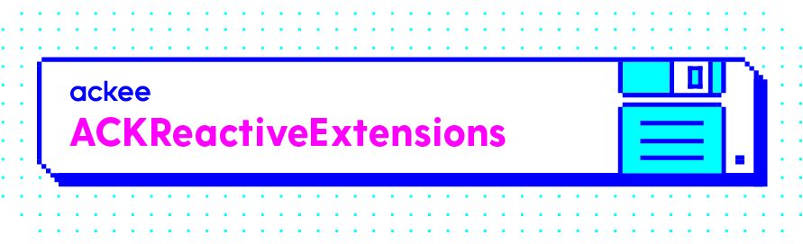

# ACKReactiveExtensions

ACKReactiveExtensions is set of useful extensions for ReactiveCocoa you could use in your apps.

Currently we have extensions for
- UIKit
- WebKit

If you'd love to have more extensions available just open an issue or even better create a pull request!

## Installation

You can use Carthage by adding it to your Cartfile:

```
github "AckeeCZ/ACKReactiveExtensions
```

Or you can use SPM by adding it to you _Package.swift_.

## Usage
Usage is really simple, ACKReactiveExtensions contains just more extensions for ReactiveSwift's `Reactive` struct so it can be used on more objects.

#### Mapping configuration

In general we are against mapping objects on main thread (and you should be too), but you know, you only live once so we still give you the opportunity to do so. By default our mapping extensions allow this behavior but if you want to restrict that, you can do that by setting a configuration variable.

```swift
ACKReactiveExtensionsConfiguration.allowMappingOnMainThread = false
```
From now on the mapping extensions will expect to be called on background thread, but don't worry, we use asserts so your production users are safe from crashing if somehow things don't go as good as expected.

### UITextField/UITextView two way binding

ACKReactiveExtensions contains special `<~>` two way binding operator which will create binding between `MutableProperty` and your `UITextField`/`UITextView`.

Until now all those bindings looked like this
```swift
let textProperty: MutableProperty<String?> ...
let textField: UITextField ...

textField.reactive.text <~ textProperty
textProperty <~ textField.reactive.continousTextValues
```

From now on you can use the `<~>` operator
```swift
textProperty <~> textField
```

The `<~>` operator is commutative so the order of operands doesn't matter.

## Author

[Ackee](https://ackee.cz) team

## License

ACKategories is available under the MIT license. See the LICENSE file for more info.

[1]:	https://twitter.com/AckeeCZ
